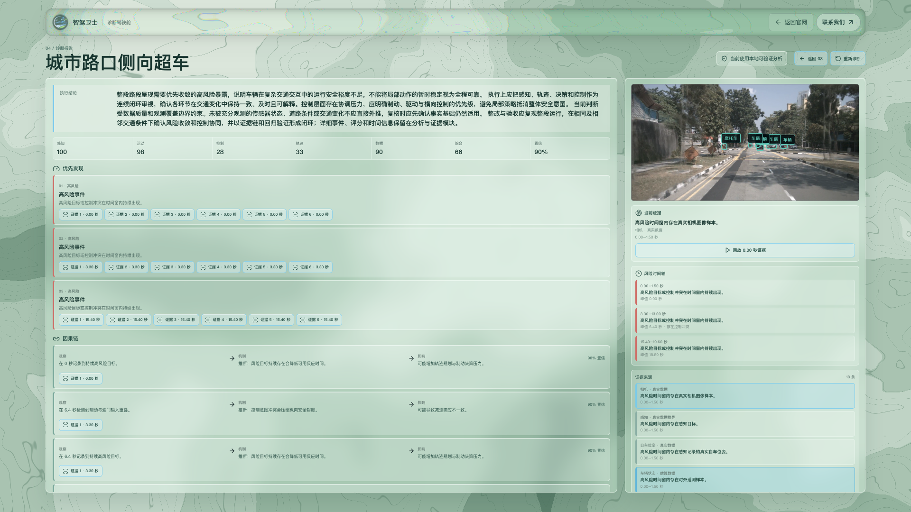

# Autodrive

一个以真实 nuScenes mini 场景为输入的自动驾驶诊断驾驶舱：前视视频、车辆状态、BEV / 地图、LiDAR 与可追溯的诊断证据在同一时间轴上同步呈现。

## What this demonstrates

- 十个中文命名的驾驶场景，可通过鼠标或键盘在入口、实时解析与全域诊断三屏间切换。
- 同一播放节点驱动前视视频、感知结果、点云、地图轨迹和风险时间线，切屏不重置播放进度或倍速。
- WebSocket 当前帧诊断与异步全场景报告。报告事实由本地确定性规则生成；可选模型只增强叙事表达。

这是**源码优先**的交付：提交中刻意不包含生成后的场景视频、遥测、感知、LiDAR 帧或 MCAP 大文件。准备本地 nuScenes mini 后，下面的构建脚本会在本机补齐十个场景。

## Demo video



[Watch the approximately 111-second (about two-minute) release demo](https://github.com/Melon1234123/Autodrive/releases/tag/source-only-v1)

Release 视频只用于展示功能；它不是仓库依赖，也不会被 clone 到本地。

## Requirements

- macOS、Linux，或能够运行 zsh 脚本的环境
- Python 3.9+、Node.js 18+、npm、git
- `ffmpeg`：将 nuScenes CAM_FRONT 帧合成为本地视频
- 已解压的 nuScenes mini 数据集；默认位置为 `$HOME/Datasets/nuscenes-mini-5gb`

macOS 可通过 Homebrew 安装 ffmpeg：

```bash
brew install ffmpeg
```

下载源码：

```bash
git clone https://github.com/Melon1234123/Autodrive.git
cd Autodrive
```

## Generate local scene data

先准备 nuScenes mini，使数据根目录包含 `v1.0-mini/`、`samples/` 和 `sweeps/`。如果数据集不在默认位置，设置 `NUSCENES_DATAROOT` 指向其根目录。

第一次先运行一次启动脚本，以创建 Python 环境；然后在**启动 Demo 前**运行十场景构建器：

```bash
./dakai
./guandiao
NUSCENES_DATAROOT=/path/to/nuscenes-mini ./scripts/build_demo_assets.sh
```

若使用默认位置，最后一行可直接写成：

```bash
./scripts/build_demo_assets.sh
```

构建器会依次生成 `default` 与 `scene-0061`、`scene-0103`、`scene-0553`、`scene-0655`、`scene-0757`、`scene-0916`、`scene-1077`、`scene-1094`、`scene-1100` 的本地视频、telemetry、感知数据和 LiDAR 索引/帧，并保留 `frontend/public/scenes.json` 中的中文文案。这些产物均被忽略，不应提交。

详细的下载、数据目录、重建与排错说明见 [GitHub 下载复现教程](docs/github-reproduction-guide.md)。

## Start and stop

```bash
./dakai
```

打开 `http://localhost:5173/`；后端健康检查为 `http://localhost:8080/health`。停止前后端：

```bash
./guandiao
```

可选模型配置写入本机 `backend/.env`（不要提交）：

```bash
cp backend/.env.example backend/.env
```

没有有效 API Key 或服务不可达时，应用仍会以本地 fallback 模式运行。

## Test

```bash
cd frontend
npm install
npx playwright install chromium
npm test -- --run
npm run build

cd ..
backend/.venv/bin/python -m pytest harness/tests tests -q

# E2E 默认自行启动并回收 5173/8080；先停掉手动 Demo。
./guandiao
cd frontend
npm run test:e2e
```

`npm run test:e2e` 默认不复用端口进程。仅在确认手动服务正是当前工作树代码时，才使用 `PW_REUSE_EXISTING=1 npm run test:e2e`。

## Deterministic local report versus model-enhanced narration

无需 API Key 的本地规则会生成风险分数、事件、证据和报告事实。配置 OpenAI-compatible API 后，模型只能在受约束范围内选择展示重点和叙述风格，**不能改写确定性的分数、事件、证据或其他报告事实**。模型超时、不可达或返回无效内容时，系统保留完整本地报告并继续演示。`/health.mode` 只表示后端是否检测到模型凭据配置，不能证明某次诊断实际使用了模型；请以诊断完成后页面报告的生成状态/降级原因（或对应诊断响应）为准。

## Data provenance and limitations

- 场景输入来自你本机持有的 nuScenes mini；视频由 CAM_FRONT 帧生成，感知、轨迹和 LiDAR 回放由仓库脚本转换/裁剪得到。
- 仓库不随附 nuScenes 原始数据，也不承诺 Release 视频中的生成文件可被下载或复用。
- 这是研究与交互演示，不是车辆控制系统、实时感知模型评测或安全认证结论。
- 根目录的 `docs/` 还保留 [nuScenes 数据说明](docs/nuscenes-data-guide.md) 与 [Foxglove / MCAP 指南](docs/foxglove-mcap-guide.md)。

## Troubleshooting

- **场景为空或视频不播放**：确认先运行了 `./scripts/build_demo_assets.sh`，并检查 `NUSCENES_DATAROOT` 和 `ffmpeg`。
- **构建器提示缺少 Python**：先执行一次 `./dakai` 创建 `backend/.venv`，再 `./guandiao` 后重试。
- **端口被占用**：执行 `./guandiao`，再重新运行 `./dakai`。
- **诊断显示 fallback**：这是无 API Key、网络不可达或模型响应无效时的正常降级；先检查 `backend/.env`，再用 `http://localhost:8080/health` 确认后端是否检测到凭据配置。该端点不反映某次诊断的实际结果；重新运行诊断后，以页面报告中的生成状态/降级原因（或对应诊断响应）确认。
